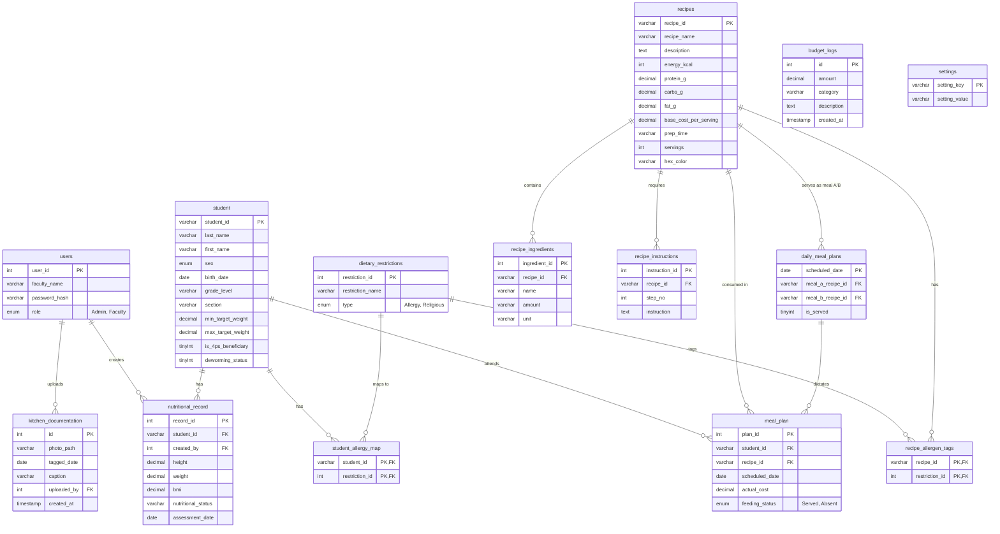

# AlgoMeal System Class Diagram (ERD view)

Here is the exhaustive text representation of the system architecture mapped as a Mermaid Entity-Relationship/Class Diagram. 

This diagram captures the data properties of each entity and their respective cardinalities and relationships (such as one-to-many bonds between `student` and `meal_plan` and `nutritional_record`).

Because AlgoMeal relies heavily on Procedural PHP paired with MySQL, this relational database structure serves as your actual definitive structural schema for all data models.
